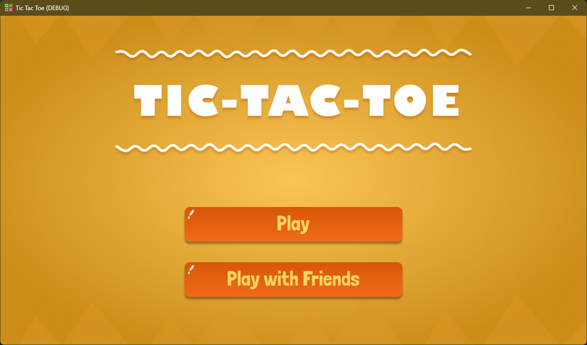
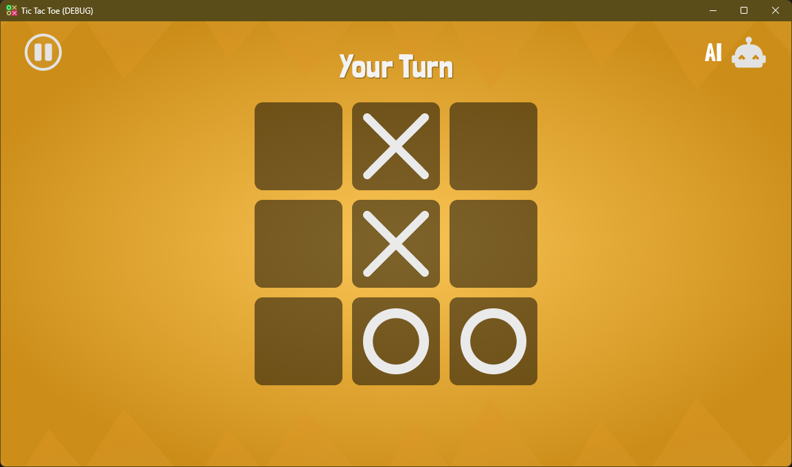
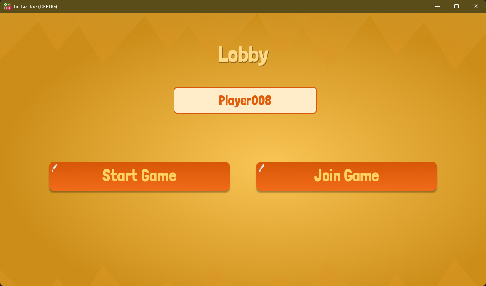

# TIC TAC TOE
A standard tic tac toe game built using Godot game engine. The player can play using computer or with another player

**Genre:** Puzzle

## Game Features:

* Single Player with AI
* Multiplayer with Friends

## Godot Features:

* Nodes and Scenes
* Control Nodes
* Animation using Tweens
* Multiplayer using WebSockets and Multiplayer API
* Autoloads

## Screen Shots:

Home/MainMenu

GamePlay

Lobby
